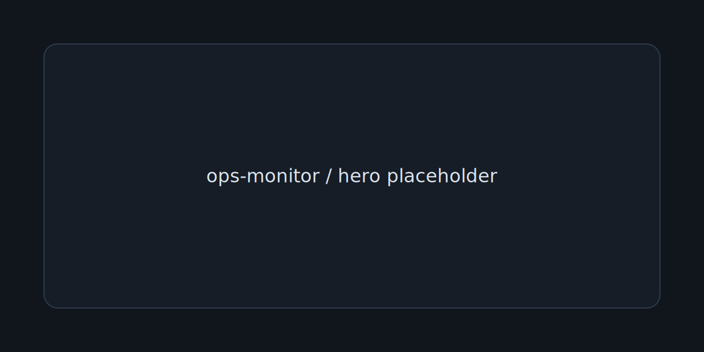
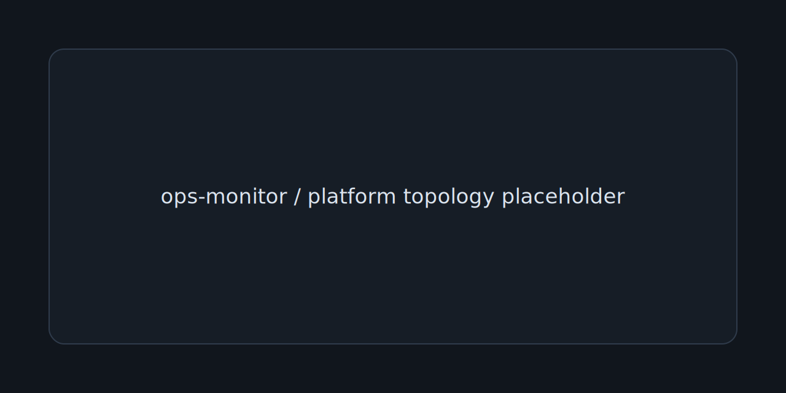
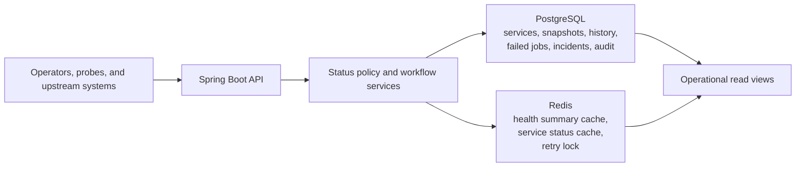
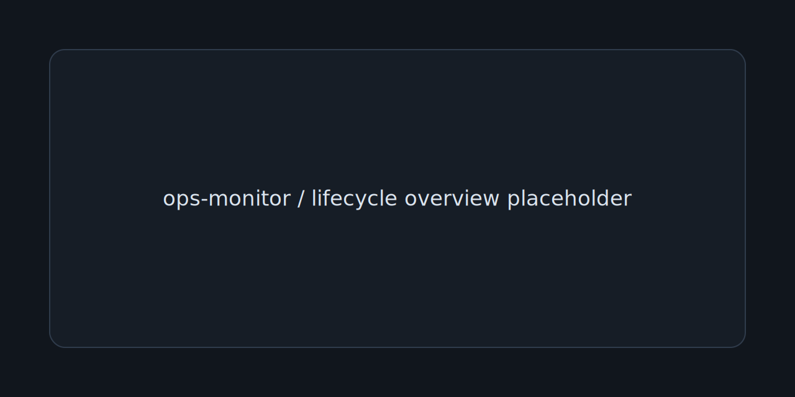
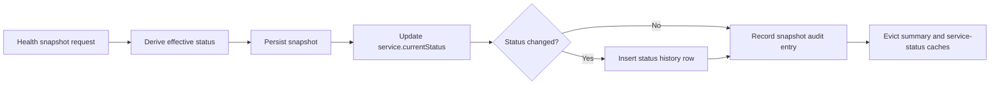
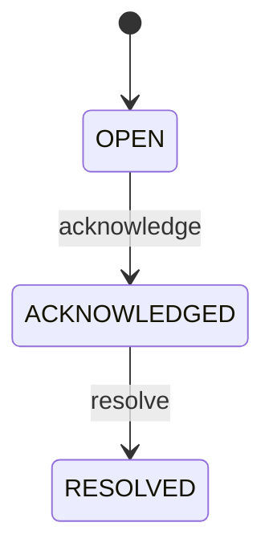
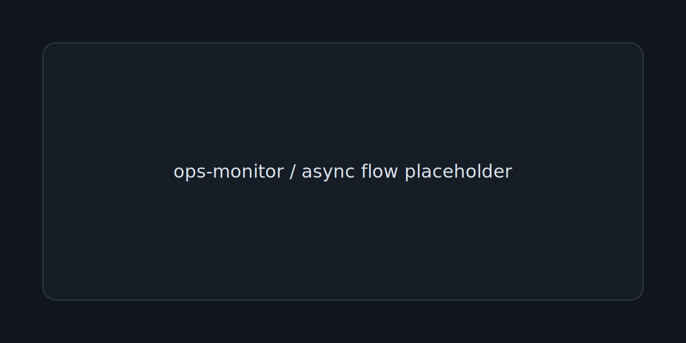

# ops-monitor



Spring Boot operations backend for service health, retry intervention, incident lifecycle management, and auditable operator actions.

`ops-monitor` is structured like an operational control-plane service rather than a generic CRUD sample: PostgreSQL holds the durable record, Redis accelerates high-value read models and protects retry execution, and the API exposes explicit lifecycle transitions that are easy to review, test, and reason about.

## Quick Navigation

- [Why This Repository Matters](#why-this-repository-matters)
- [Architecture Overview](#architecture-overview)
- [Workflow and Lifecycle Model](#workflow-and-lifecycle-model)
- [Capability Matrix](#capability-matrix)
- [API Overview](#api-overview)
- [Operational Flow and Control Model](#operational-flow-and-control-model)
- [Local Workflow](#local-workflow)
- [Validation and Quality](#validation-and-quality)
- [Repository Structure](#repository-structure)
- [Docs Map](#docs-map)
- [Scope Boundaries](#scope-boundaries)
- [Future Improvements](#future-improvements)

## Why This Repository Matters

Many backend demos stop at storing entities and exposing endpoints. `ops-monitor` goes further by modeling the operational behaviors that make backend systems credible in production-facing environments:

- service status is derived from incoming health signals instead of being toggled manually
- failed jobs move through guarded retry states with lock protection, retry budgets, and attempt history
- incidents follow an explicit lifecycle instead of free-form note storage
- sensitive actions leave a queryable audit trail
- access is separated between public health, API roles, and actuator management credentials

That combination makes the repository useful as a backend and operations portfolio project: it shows workflow design, consistency thinking, and boundary setting, not just framework familiarity.

## Architecture Overview



At the center of the system is a Spring Boot API that manages a compact but deliberate operational domain:

- `MonitoredService` represents the service registry and current operational state.
- `HealthSnapshot` captures point-in-time signals and drives derived service status.
- `ServiceStatusHistory` records status transitions when the effective state changes.
- `FailedJob` and `RetryAttempt` model operator-driven retry intervention with a budget and a trace.
- `IncidentNote` tracks an incident from `OPEN` to `ACKNOWLEDGED` to `RESOLVED`.
- `AuditEntry` provides a durable trail for sensitive control-plane actions.

PostgreSQL is the system of record for these workflows. Redis is used only for fast read paths and short-lived coordination: a cached global summary, cached per-service status views, and a retry lock keyed by failed-job ID.



| Area | Implemented behavior | Backing store |
| --- | --- | --- |
| Monitored services | Service registry with environment, owner, endpoint, current status, and last snapshot timestamp | PostgreSQL |
| Health snapshots | Point-in-time health input with source, latency, error signal, and derived status | PostgreSQL |
| Service status history | Transition log written only when a service changes state | PostgreSQL |
| Failed jobs and retries | Retry budget, retry state, next retry time, and immutable retry-attempt history | PostgreSQL |
| Incidents | Incident note record with severity, lifecycle status, actor fields, and timestamps | PostgreSQL |
| Audit trail | Queryable action log for service registration, snapshots, status changes, retries, and incident actions | PostgreSQL |
| Read optimization and coordination | Cached summary views and per-job retry lock | Redis |

More detail: [docs/architecture.md](docs/architecture.md)

## Workflow and Lifecycle Model



The repository is strongest when read as a set of operational workflows rather than a list of entities.

### Health Snapshot Ingestion

`POST /api/v1/health-snapshots` is the entry point for health updates. The write path validates the request, derives the effective service status, persists the snapshot, updates the service's current status, appends history on transitions, records audit entries, and evicts affected caches.



| Snapshot signal | Result |
| --- | --- |
| Reported status | Baseline effective state |
| Non-blank `errorMessage` | Escalates to at least `DEGRADED` |
| `latencyMs >= 1200` | Escalates to at least `DEGRADED` |
| `latencyMs >= 5000` | Escalates to `DOWN` |
| Effective status differs from previous service status | Writes `service_status_history` and `SERVICE_STATUS_CHANGED` audit entry |

### Failed-Job Retry Flow

Retries are explicit operator actions, not invisible background work. A retry request acquires a Redis lock, validates retryability, increments the attempt counter, computes the resulting job state, records a `RetryAttempt`, emits an audit entry, and invalidates impacted caches.

| Condition | Resulting behavior |
| --- | --- |
| Lock already held for the failed job | Request is rejected with `409 CONFLICT` |
| Outcome is `SUCCESS` | Failed job moves to `RECOVERED` |
| Outcome is `FAILED` and retry budget remains | Failed job moves to `RETRY_SCHEDULED` and computes `nextRetryAt` using the backoff policy |
| Outcome is `FAILED` on the final allowed attempt | Failed job moves to `EXHAUSTED` |

Backoff policy is intentionally readable: attempt `1` schedules `+1 minute`, attempt `2` schedules `+5 minutes`, and attempt `3+` schedules `+15 minutes`.

### Incident Lifecycle

Incidents are modeled as operational records with explicit transitions and actor fields.



Only `OPEN` incidents can be acknowledged, and only `ACKNOWLEDGED` incidents can be resolved. Invalid transitions return `409 CONFLICT`, generate no side effects, and preserve the current incident state.

### Audit Generation

Sensitive write paths create durable audit entries with actor information and structured details:

- service registration
- health snapshot recording
- service status changes
- failed-job retry requests
- incident creation
- incident acknowledgement
- incident resolution

This makes the project read like an operational backend with accountability rather than a write-only admin panel.

## Capability Matrix

| Capability | Implemented | Why it matters |
| --- | --- | --- |
| Monitored services | Searchable service registry with environment and owner-team metadata | Gives operations a stable control-plane surface |
| Health snapshots | Snapshot ingestion with source, latency, error message, and derived status | Turns raw signals into durable operational state |
| Status history | Transition history for service state changes | Supports review, debugging, and incident reconstruction |
| Failed jobs | Failed-job inventory with retry counters, limits, and scheduling fields | Makes job recovery a first-class workflow |
| Retry handling | Operator-triggered retry with Redis lock and attempt log | Prevents duplicate intervention and preserves traceability |
| Incident lifecycle | `OPEN -> ACKNOWLEDGED -> RESOLVED` with actor/timestamp fields | Keeps incident handling explicit and reviewable |
| Audit entries | Filterable audit endpoint for sensitive actions | Provides forensic and reviewer-facing accountability |
| Redis caching and locks | Global summary cache, per-service status cache, per-job retry lock | Improves hot read paths and protects mutation flows |
| Role-aware access | Public health, `VIEWER`, `OPERATOR`, `ADMIN`, and separate `MANAGEMENT` credential | Demonstrates deliberate operational boundaries |
| Docker workflow | Compose stack for app, PostgreSQL, Redis, and Maven tooling | Keeps setup fast and repeatable |
| Tests and CI | Unit and integration coverage plus GitHub Actions validation | Shows discipline around behavior, not just structure |

## API Overview

The README keeps the API summary compact. Full endpoint detail lives in [docs/api-overview.md](docs/api-overview.md).

| Endpoint family | Representative routes | Purpose | Access |
| --- | --- | --- | --- |
| Health | `GET /api/v1/health`, `GET /api/v1/health/readiness` | Public operational posture and readiness | Public |
| Services | `GET /api/v1/services`, `GET /api/v1/services/{id}`, `GET /api/v1/services/{id}/status`, `POST /api/v1/services` | Registry queries, status drill-down, service registration | `VIEWER+`, create is `ADMIN` |
| Health snapshots | `POST /api/v1/health-snapshots`, `GET /api/v1/health-snapshots` | Ingest and review health signals | Read `VIEWER+`, write `OPERATOR+` |
| Failed jobs | `GET /api/v1/failed-jobs`, `GET /api/v1/failed-jobs/{id}`, `POST /api/v1/failed-jobs/{id}/retry` | Review failures and trigger retries | Read `VIEWER+`, retry `OPERATOR+` |
| Incidents | `GET /api/v1/incidents`, `GET /api/v1/incidents/{id}`, `POST /api/v1/incidents`, lifecycle actions | Track and progress operational incidents | Read `VIEWER+`, write `OPERATOR+` |
| Audit | `GET /api/v1/audit-entries` | Query sensitive action history | `ADMIN` |

Interactive docs are available at `/swagger-ui.html` and `/api-docs`.

## Operational Flow and Control Model



Even though retry execution is synchronous today, the repository still models operational coordination explicitly through role boundaries, cache invalidation, and lock-based write protection.

| Boundary | Rule |
| --- | --- |
| Public | `GET /api/v1/health`, `GET /api/v1/health/readiness`, Swagger/OpenAPI docs |
| `VIEWER` | Read-only access to services, snapshots, failed jobs, and incidents |
| `OPERATOR` | Snapshot ingestion, failed-job retry, incident creation, acknowledge, and resolve |
| `ADMIN` | All operator capabilities plus service registration and audit-entry access |
| `MANAGEMENT` | Separate credential for `/actuator/**`; API roles cannot use it |

- Retry safety is implemented with a Redis `setIfAbsent` lock and TTL, then released in a `finally` block after the retry attempt completes.
- Cached read models expose a `cached` boolean in the response so callers can tell whether a summary or service view came from Redis.
- Snapshot writes, retry writes, and incident lifecycle changes evict the global health summary and the affected service-status cache entry.
- Service registration evicts the global summary so aggregate counts remain consistent.

Access and security details: [docs/security.md](docs/security.md)

## Local Workflow

The local path is intentionally Docker-first so reviewers can run the same stack without installing PostgreSQL or Redis directly.

```bash
cp .env.example .env
docker compose up -d --build app
curl http://localhost:3005/api/v1/health
curl -u ops_viewer:ops_viewer_password \
  http://localhost:3005/api/v1/services/22222222-2222-2222-2222-222222222222/status
```

For PowerShell, replace `cp` with `Copy-Item`.

| Interface | Address |
| --- | --- |
| API base | `http://localhost:3005` |
| Swagger UI | `http://localhost:3005/swagger-ui.html` |
| OpenAPI document | `http://localhost:3005/api-docs` |
| Actuator health | `http://localhost:3005/actuator/health` |
| PostgreSQL | `localhost:5437` |
| Redis | `localhost:6384` |

Flyway migrations run automatically on startup. `V2__seed_demo_data.sql` seeds monitored services, snapshots, failed jobs, retry attempts, incidents, and audit entries so the API is immediately explorable after boot.

Developer and Docker notes: [docs/local-development.md](docs/local-development.md)

## Validation and Quality

| Check | Command | Validates |
| --- | --- | --- |
| Compose configuration | `docker compose config > /dev/null` | Service wiring and environment interpolation |
| Formatting | `docker compose --profile tooling run --rm maven bash -lc "chmod +x mvnw && ./mvnw spotless:check"` | Java formatting and import hygiene |
| Tests | `docker compose --profile tooling run --rm maven bash -lc "chmod +x mvnw && ./mvnw test"` | Unit and integration coverage across status, retry, incident, cache, and access flows |
| Package build | `docker compose --profile tooling run --rm maven bash -lc "chmod +x mvnw && ./mvnw -DskipTests package"` | Production jar packaging |
| Runtime smoke check | `curl http://localhost:3005/api/v1/health` | Public operational summary |
| Management smoke check | `curl -u ops_management:ops_management_password http://localhost:3005/actuator/health` | Separate management access path |

CI mirrors the core validation path in [`.github/workflows/ci.yml`](.github/workflows/ci.yml).

## Repository Structure

```text
.
|-- .github/workflows/        GitHub Actions CI workflow
|-- assets/readme/            README placeholder visuals for future custom SVG artwork
|-- docker/java/              multi-stage runtime image build
|-- docs/                     architecture, domain, API, security, dev, deployment, roadmap
|-- src/main/java/            Spring Boot API, application services, domain, infrastructure
|-- src/main/resources/       application configuration and Flyway migrations
|-- src/test/java/            unit and integration test suites
|-- .env.example              local runtime defaults
|-- docker-compose.yml        local app, PostgreSQL, Redis, and tooling stack
`-- pom.xml                   Maven build definition
```

## Docs Map

| Document | Focus |
| --- | --- |
| [docs/architecture.md](docs/architecture.md) | layered design, topology, consistency model, and write/read paths |
| [docs/domain-model.md](docs/domain-model.md) | core entities, relationships, status rules, retry states, incident lifecycle |
| [docs/api-overview.md](docs/api-overview.md) | endpoint families, access model, pagination, and API behavior notes |
| [docs/security.md](docs/security.md) | authentication model, authorization boundaries, hardening measures, trade-offs |
| [docs/local-development.md](docs/local-development.md) | Docker-first workflow, credentials, seed data, and validation commands |
| [docs/deployment-notes.md](docs/deployment-notes.md) | container/runtime packaging, config surface, startup sequence, deployment posture |
| [docs/roadmap.md](docs/roadmap.md) | realistic next steps and intentional future extensions |

## Scope Boundaries

- Authentication is intentionally environment-backed, in-memory, and HTTP Basic for clarity and local portability.
- Retry execution is a synchronous operator-triggered workflow; there is no background retry worker or queue executor in the current implementation.
- Incident handling is purposefully compact: one incident record, linked context, lifecycle timestamps, and no assignment/escalation engine.
- Redis is not treated as a source of truth; it is only a cache and coordination layer.
- Seed data is part of the current Flyway sequence for demoability, which is appropriate for local review but would be separated for hosted production use.

## Future Improvements

- Introduce token or API-key based auth backed by persistent principals while keeping the current role model.
- Add asynchronous retry execution while preserving the existing retry endpoint as the operator control surface.
- Expand operational notifications and audit export to external observability or SIEM systems.
- Add richer incident ownership, escalation, and environment/team roll-up views.

## License

See [LICENSE](LICENSE).
