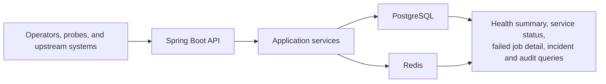

# Architecture

`ops-monitor` is a focused operations backend built around explicit write paths, durable state transitions, and readable boundaries. The project is intentionally small enough to review quickly while still modeling the kinds of operational concerns that matter in production systems.

Related reading: [README](../README.md), [Domain Model](domain-model.md), [API Overview](api-overview.md), [Security](security.md)

## Design Intent

- keep PostgreSQL as the durable record for operational workflows
- treat Redis as an optimization and coordination layer, not a source of truth
- expose state transitions explicitly through application services and HTTP endpoints
- make access boundaries and side effects obvious to reviewers

## Runtime Topology

The local stack is Docker Compose based and mirrors the repository's architectural split:

- `app`: Spring Boot API and workflow orchestration
- `postgres`: authoritative persistence for services, snapshots, retries, incidents, and audit records
- `redis`: cached read models and short-lived retry locks
- `maven`: tooling container for formatting, tests, and packaging

| Component | Responsibility | Persistence or coordination role |
| --- | --- | --- |
| API layer | Request validation, pagination/sort bounds, response envelopes, exception mapping | Stateless HTTP surface |
| Application services | Status derivation, retry orchestration, incident lifecycle, audit generation, cache eviction | Transaction and workflow orchestration |
| PostgreSQL | Monitored services, health snapshots, status history, failed jobs, retry attempts, incidents, audit entries | System of record |
| Redis | Global health summary cache, per-service status cache, retry lock | Fast read model and short-lived lock |
| Actuator | Runtime health and info endpoints | Separate management plane |

## Code Structure

| Package | Primary responsibility | Representative types |
| --- | --- | --- |
| `com.example.opsmonitor.api` | Controllers, request/response DTOs, response envelopes, exception handling | `ServiceController`, `FailedJobController`, `GlobalExceptionHandler` |
| `com.example.opsmonitor.application` | Workflow orchestration and business rules | `HealthSnapshotService`, `FailedJobService`, `IncidentNoteService`, `ServiceStatusPolicy` |
| `com.example.opsmonitor.domain` | JPA entities and enum state models | `MonitoredService`, `FailedJob`, `IncidentNote`, `ServiceStatus` |
| `com.example.opsmonitor.infrastructure` | Repositories, specifications, cache adapters, security, configuration | `StatusCacheService`, `RetryLockService`, `SecurityConfig` |

This keeps controller code thin, pushes lifecycle decisions into the application layer, and leaves infrastructure concerns explicit instead of implicit.

## Core Write Paths

| Workflow | Trigger | Durable writes | Side effects |
| --- | --- | --- | --- |
| Health snapshot ingestion | `POST /api/v1/health-snapshots` | `health_snapshot`, `monitored_service`, optionally `service_status_history`, plus audit rows | Evict global summary and per-service status cache |
| Failed-job retry | `POST /api/v1/failed-jobs/{id}/retry` | `failed_job`, `retry_attempt`, plus audit row | Acquire/release Redis lock and evict impacted caches |
| Incident lifecycle | `POST /api/v1/incidents`, `/acknowledge`, `/resolve` | `incident_note`, plus audit row | Evict global summary and per-service status cache |
| Service registration | `POST /api/v1/services` | `monitored_service`, plus audit row | Evict global summary cache |

### Health Snapshot Flow

`HealthSnapshotService` derives the effective status from the reported status, latency, and error signal before it persists anything. That sequence matters because the service table stores the current operational state, not just the last reported state.

If the effective status differs from `MonitoredService.currentStatus`, the application writes a `service_status_history` row and records a `SERVICE_STATUS_CHANGED` audit entry. Snapshot ingestion always records a `HEALTH_SNAPSHOT_RECORDED` audit entry.

### Failed-Job Retry Flow

`FailedJobService` treats retry as a guarded control-plane action:

1. acquire a Redis lock keyed by failed-job ID
2. reject non-retryable jobs or concurrent retry attempts
3. increment the retry count and transition through retry states
4. persist a `RetryAttempt`
5. record `FAILED_JOB_RETRY_REQUESTED`
6. evict cached summaries and release the lock

Current behavior is synchronous and API-driven. There is no background retry executor in this repository.

### Incident Flow

Incidents start as `OPEN`, can move to `ACKNOWLEDGED`, and then to `RESOLVED`. Transition rules are enforced in `IncidentNoteService`; invalid state changes return `409 CONFLICT` and do not create audit or cache side effects.

## Read Paths and Cache Behavior

Two read models are intentionally cached in Redis:

- `GET /api/v1/health`: global operational summary with service-state counts, active failed jobs, active incidents, and a `cached` flag
- `GET /api/v1/services/{id}/status`: per-service status view with current status, recent snapshots, recent transition history, and a `cached` flag

The project chooses cache eviction over partial cache mutation. That keeps write paths easier to reason about and ensures Redis remains a disposable acceleration layer.

## Consistency Model

- PostgreSQL is the source of truth for every durable workflow and timeline.
- Flyway manages schema evolution and demo data loading.
- JPA runs with `ddl-auto=validate`, which makes schema drift visible at startup.
- Write workflows are transactional at the service layer.
- Redis failures do not redefine domain state; at worst they degrade cache or lock behavior.

One important scope note: demo data currently ships as part of the Flyway sequence. That is useful for local review and portfolio presentation, but a hosted production setup would usually split demo fixtures from operational migrations.

## Security and Operational Boundaries

- public endpoints expose operational posture and OpenAPI docs
- API roles separate readers, operators, and administrators
- actuator endpoints live behind a separate management credential

The detailed access model is documented in [security.md](security.md).

## Reviewer Takeaways

What makes this architecture worth reviewing is not size, but discipline:

- service status is derived, not toggled
- retries are guarded and traceable
- incidents are lifecycle-driven
- auditability is part of the write path
- caching is deliberate and bounded

That combination gives the project more operational weight than a standard CRUD backend without pretending to be a full internal platform.
