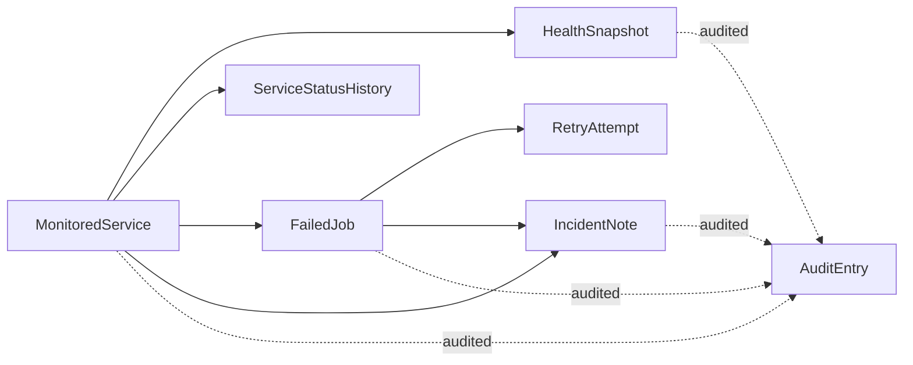
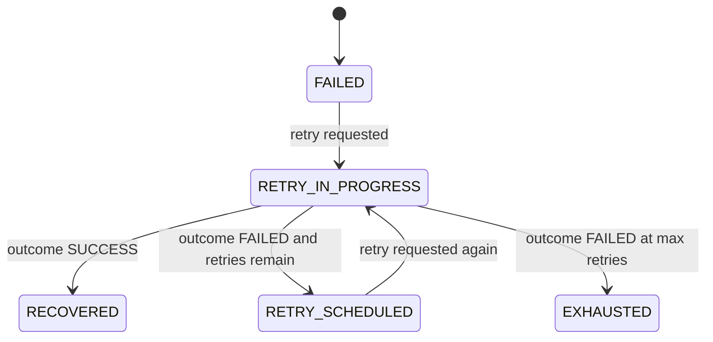
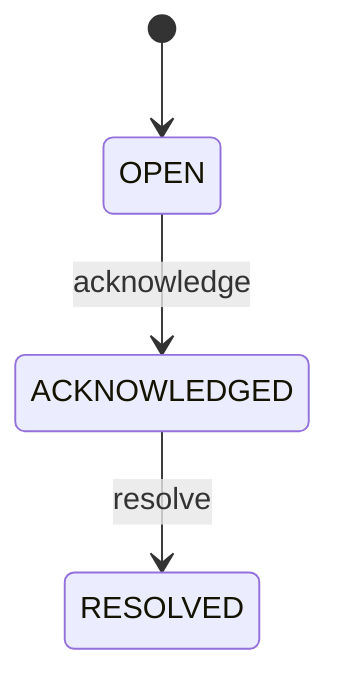

# Domain Model

The domain is centered on operational state and intervention, not just configuration records. Every major table exists to answer one of three questions:

- what is happening right now
- what changed to get here
- who performed the sensitive action

Related reading: [README](../README.md), [Architecture](architecture.md), [API Overview](api-overview.md)

## Core Aggregates

| Entity | Role in the system | Key fields | Notes |
| --- | --- | --- | --- |
| `MonitoredService` | Registry entry and current operational posture for a service | `name`, `environment`, `ownerTeam`, `endpointUrl`, `currentStatus`, `lastSnapshotAt` | Holds the current derived state used by summary and drill-down endpoints |
| `HealthSnapshot` | Point-in-time health input | `status`, `latencyMs`, `errorMessage`, `source`, `recordedAt` | Stores the effective derived status, not only the reported input |
| `ServiceStatusHistory` | Append-only service transition log | `previousStatus`, `newStatus`, `reason`, `changedAt` | Written only when a service actually changes state |
| `FailedJob` | Durable failed-work item awaiting review or retry | `externalJobId`, `jobType`, `state`, `retryCount`, `maxRetries`, `lastFailureAt`, `nextRetryAt` | Encodes retry budget and current recovery posture |
| `RetryAttempt` | Immutable trace of each retry command | `attemptNumber`, `requestedBy`, `outcome`, `message`, `triggeredAt` | Preserves operator intent and result per attempt |
| `IncidentNote` | Operational incident record tied to a service or failed job | `severity`, `status`, `title`, `note`, `author`, `acknowledgedBy`, `resolvedBy` | Represents both context capture and lifecycle tracking |
| `AuditEntry` | Queryable audit trail for sensitive actions | `entityType`, `entityId`, `action`, `actor`, `detailsJson`, `createdAt` | Used for forensic review and reviewer-facing accountability |

## Relationship View

## Service Status Derivation

Service state is driven by snapshots and a small policy object, not by manual writes to the service table.

| Input signal | Policy effect | Why it matters |
| --- | --- | --- |
| Reported status | Establishes the baseline derived state | Allows upstream systems or operators to report direct status |
| Non-blank `errorMessage` | Raises status to at least `DEGRADED` | Captures partial failure even if the reported status was optimistic |
| `latencyMs >= 1200` | Raises status to at least `DEGRADED` | Models slow-but-serving behavior |
| `latencyMs >= 5000` | Raises status to `DOWN` | Models hard operational degradation from latency alone |
| Derived status differs from `MonitoredService.currentStatus` | Persists a `ServiceStatusHistory` row and emits a status-change audit event | Preserves the transition timeline without duplicating unchanged state |

The service table therefore acts as a current read model, while `HealthSnapshot` and `ServiceStatusHistory` preserve supporting evidence.

## Failed-Job State Model

`FailedJob` is the repository's recovery-focused aggregate. It starts from failure, carries a retry budget, and advances only when an operator invokes retry.

Important modeled behavior:

- `retryCount < maxRetries` is required for retryability
- `RECOVERED` and `EXHAUSTED` are terminal from the API's point of view
- `nextRetryAt` is advisory scheduling metadata, not a worker queue contract
- retry attempts are immutable even though the failed-job record changes over time

## Incident Lifecycle

Incidents are intentionally compact but lifecycle-aware.

Key constraints:

- at least one of `serviceId` or `failedJobId` must be present
- if both are present, the failed job must belong to the provided service
- only `OPEN` incidents may be acknowledged
- only `ACKNOWLEDGED` incidents may be resolved

This design is enough to demonstrate incident accountability without expanding into assignment, escalation, or paging policies.

## Audit Model

`AuditEntry` is intentionally generic so every sensitive workflow can record a durable event without creating a new audit table per feature.

| Audit action | Typical trigger |
| --- | --- |
| `SERVICE_CREATED` | admin registers a new monitored service |
| `HEALTH_SNAPSHOT_RECORDED` | operator submits a snapshot |
| `SERVICE_STATUS_CHANGED` | snapshot changes effective service state |
| `FAILED_JOB_RETRY_REQUESTED` | operator triggers a retry |
| `INCIDENT_NOTE_CREATED` | operator opens an incident |
| `INCIDENT_ACKNOWLEDGED` | operator acknowledges an incident |
| `INCIDENT_RESOLVED` | operator resolves an incident |

Audit rows store actor identity and JSON details so reviewers can understand not only that a transition occurred, but the operational context around it.

## Reviewer Notes

Three modeling choices give the repository most of its signal:

- current state and historical evidence are separated cleanly
- retry is treated as a state machine with guardrails, not a boolean flag
- auditability is attached to workflow transitions instead of being added later
